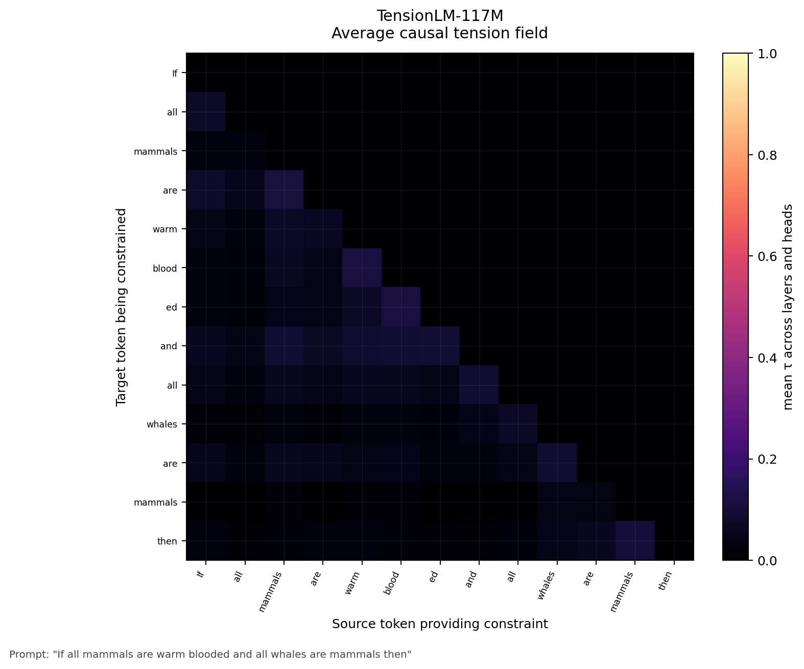
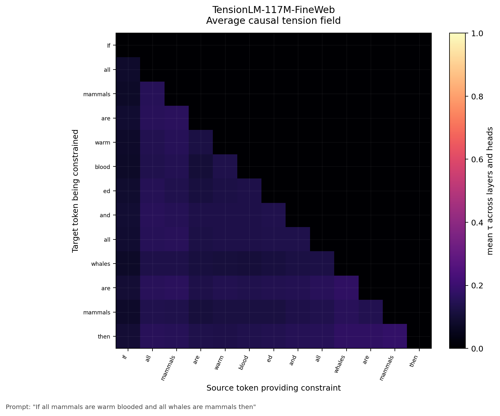
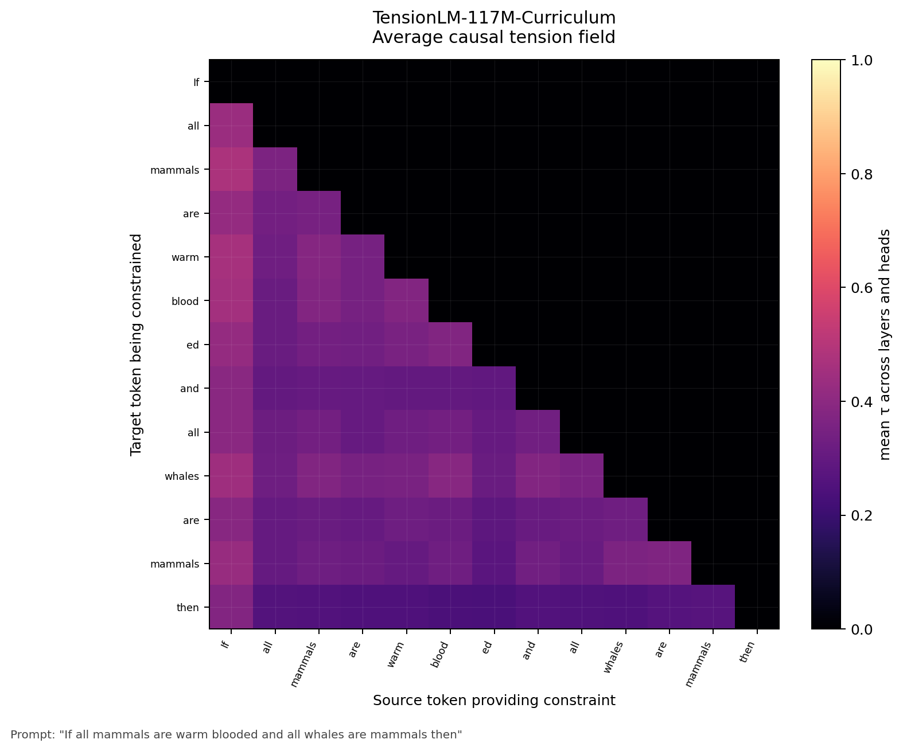
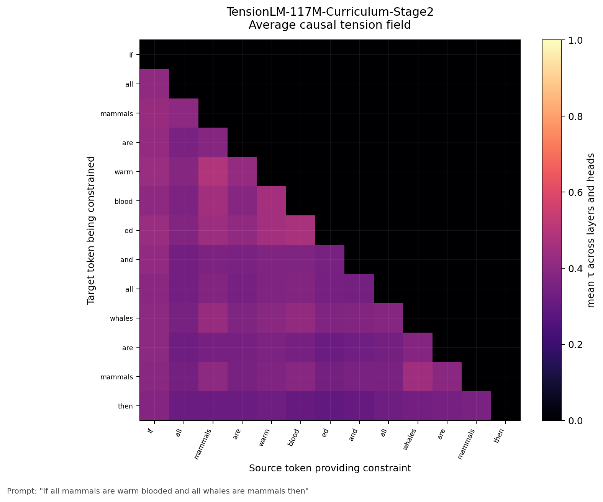
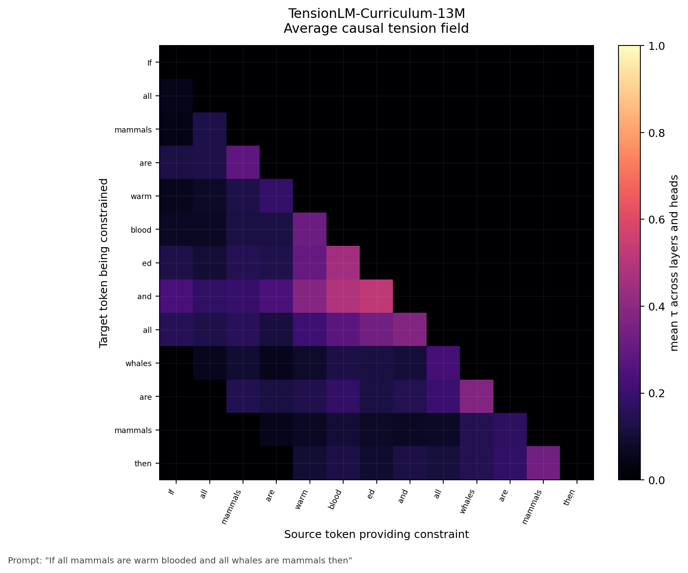
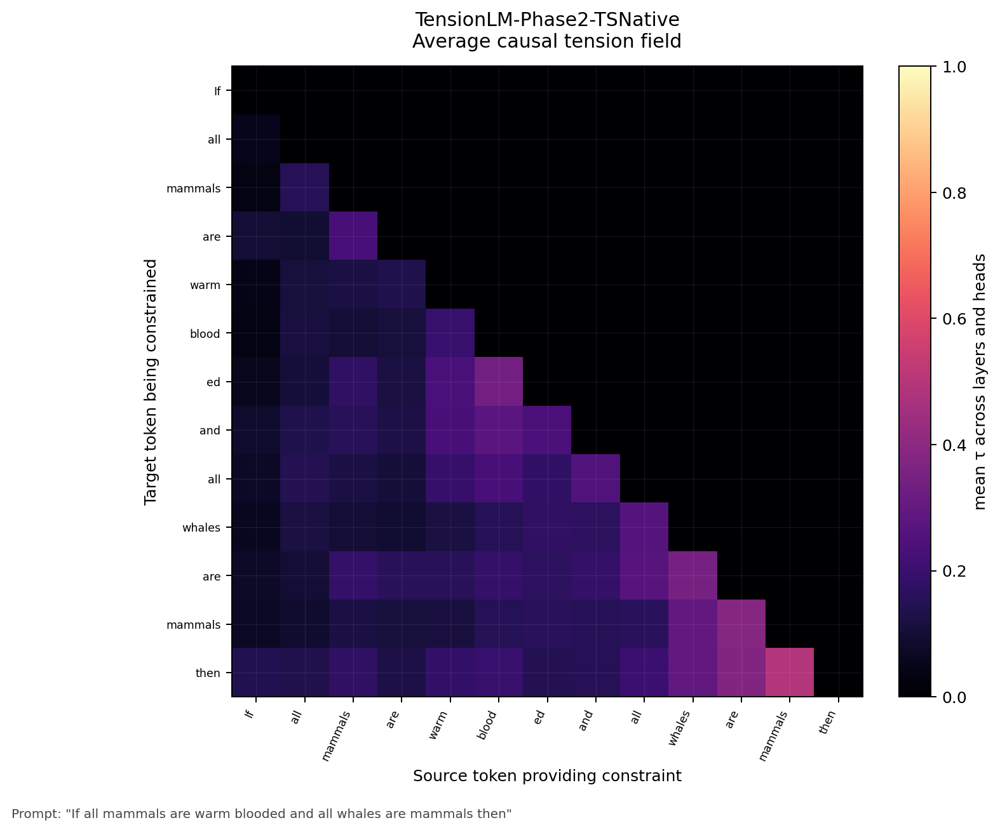

# TensionLM

A language model built on **sigmoid tension** instead of softmax attention — an empirical implementation of the Thinking System (TS) theory of computation.

**[117M Curriculum Model](https://huggingface.co/BoggersTheFish/TensionLM-117M-Curriculum)** | **[117M WikiText-103 Model](https://huggingface.co/BoggersTheFish/TensionLM-117M)** | **[Phase 2 TS-native model](https://huggingface.co/BoggersTheFish/TensionLM-Phase2-TSNative)** | **[GitHub](https://github.com/BoggersTheFish/bozo)**

---

## The theory

**Thinking System (TS)** is a framework for understanding computation — and cognition — as constraint relaxation over a graph of interdependent states.

The core claim: any system that processes information can be described as a graph where:
- **Nodes** are states (tokens, features, concepts)
- **Edges** are constraints (relationships, dependencies)
- **τ (tau)** is unresolved tension — the degree to which a constraint is active but not yet satisfied
- **Computation** is the system relaxing toward equilibrium under those constraints

Under TS, learning is the graph accumulating edges from experience. Inference is the graph finding a low-tension state given an input. Representations are not vectors — they are constraint patterns. A concept is defined not by what it *is* but by what it *constrains*.

**Why softmax attention contradicts TS.**

Standard transformers use softmax attention — a zero-sum weight distribution over positions. If token A scores high, tokens B and C are forced lower. This is a competitive mechanism: information fights for a fixed budget. Under TS this is wrong. Real constraints don't cancel each other. A concept can be simultaneously constrained by multiple past concepts at full strength — the constraints add, they don't compete.

**Why sigmoid tension is the correct implementation.**

TensionLM replaces softmax with sigmoid tension:

```
τ[t, w] = sigmoid( dot(Q[t], K[t-w]) / √head_dim )
output[t] = Σ_w  τ[t, w] · V[t-w]  /  Σ τ[t, w]
```

Each token pair is scored independently. τ[t, w] measures how strongly token t is constrained by token t-w. No global normalisation — a high score at one position suppresses nothing else. The tension field is the literal constraint graph the model has learned. Inspectable, interpretable, and directly motivated by TS theory.

The denominator divides by **tau-mass** (Σ τ) rather than valid position count — TS-correct normalisation where output is proportional to actual constraint strength.

This is not an architectural trick. It is what TS predicts the mechanism should look like.

---

## Results

### Experiment 1 — TensionLM vs Transformer (WikiText-2, 1.1M params)

Both models: dim=128, 4 layers, 4 heads, BPE vocab=2048, ~1.1M parameters. Trained 10 epochs on WikiText-2. Identical config — only the mechanism differs.

| Metric | TensionLM | Transformer |
|--------|-----------|-------------|
| Best val PPL | **57.7** | 57.8 |
| Mechanism | Sigmoid tension (windowed) | Softmax attention (full O(T²)) |

TensionLM matches the transformer at identical parameter count with a fundamentally different computation. The mechanism works.

---

### Experiment 2 — TS-native objectives (13.5M, open-web-math)

Clean comparison: same architecture (13.5M params, dim=256, 6 layers), same data (1B tokens open-web-math), same hardware. Only the training objective differs.

| Model | Val PPL | Objective |
|-------|---------|-----------|
| Baseline | **85.19** | Cross-entropy only |
| TS-native | 86.50 | Cross-entropy + constraint consistency + tension entropy |

**1.31 PPL cost** for structurally coherent constraint graphs.

The constraint consistency loss enforces transitivity — if A tensions B and B tensions C, A should tension C. The result is visible directly in the tension field:

**TS-native layer 5, head 2 on "If A then B. If B then C. Therefore":**
```
A[1]:0.32   B[3]:0.43   B[6]:0.64   C[8]:0.59   then[7]:0.50
```
The full A→B→C transitivity chain encoded as simultaneous active constraints. Baseline on the same prompt: uniform diffuse activation, no structure.

**Empirical TS validation — coherent text vs word salad:**

Coherent text produces **+25% mean τ** and **+60% more active edges** than random word salad on the same vocabulary. The constraint graph measurably responds to coherence — exactly what TS predicts.

---

### Experiment 3 — Curriculum training (13.5M)

TS predicts: teach inference structure first, then vocabulary, then formal notation. Coherent data builds coherent constraint graphs.

| Stage | Data | Tokens | Final val PPL |
|-------|------|--------|--------------|
| 1 — Logic | Synthetic inference (TS-native) | 200M | **1.51** |
| 2 — Language | WikiText-103 | 100M | **196** |
| 3 — Maths | open-web-math | 200M | **573** |

**First-contact maths PPL** (first val checkpoint after switching to maths data):

| Training history | First-contact maths PPL |
|----------------|------------------------|
| Cold start | ~2293 |
| Logic only | ~1076 |
| Logic + language | **~582** |

**4× better first contact than cold start.** Curriculum validated at 13.5M scale.

---

### Experiment 4 — 117M curriculum run

Same curriculum at full scale. Architecture upgraded: RoPE, tau-mass normalisation, global attention layers every 4 blocks, scaled weight init, fused Triton kernel.

| Stage | Data | Tokens | Best val PPL |
|-------|------|--------|-------------|
| 1 — Logic | Synthetic inference | 200M | **5.10** |
| 2 — Language | FineWeb-Edu | 500M | **339** |
| 3 — Maths | open-web-math | 2B | **359.99** |

**Stage 3 first-contact train PPL: 24** — no domain shock. The 13.5M run had first-contact ~582. Cold start ~2293. **96× better than cold start at 117M scale.**

**Minimum train PPL: 6.8.** GPT-2 (117M, same size) trained on general web text achieves ~20 train PPL. TensionLM hits 6.8 on mathematics — a substantially harder domain — because the curriculum pre-loaded constraint structure before the formal notation was introduced.

**Stage 3 early generations (step 2550)** — LaTeX notation and proof structure appearing immediately:
```
To prove this by contradiction assume that $\theta_n \in [0,1]$.
It is true to say that if $A = 1\left(A+B|A-B|\right)^2$ then
the result of a series converges to $A_1 = B_0^{-1} + C_3^{-2} \rightarrow B_n^{+1}$
```

---

### Experiment 5 — Formal reasoning evaluation

23-question benchmark across syllogisms, transitivity, arithmetic, calculus, algebra, and definitions. Evaluated on the best checkpoint (step 14,000, val PPL 359.99):

| Category | Score |
|----------|-------|
| Algebra | 67% (2/3) |
| Definitions | 67% (2/3) |
| Arithmetic | 50% (2/4) |
| Calculus | 50% (2/4) |
| Transitivity | 33% (1/3) |
| Syllogisms | 17% (1/6) |
| **Overall** | **43.5% (10/23)** |

**Key finding:** The best reasoning checkpoint is step 14,000, not the final checkpoint. The second epoch of maths data partially overwrites the logic structure loaded in stage 1 — a sweet spot exists before full saturation. This is a direct TS prediction: adding dense constraints of a new type can displace existing coherent constraints if the training signal is not carefully managed.

Run the eval yourself:
```bash
python3 formal_eval.py --checkpoint checkpoints/stage3_math_117m/ckpt_0014000.pt
```

---

## What the tension field shows

The public Hugging Face checkpoints now include model-card heatmaps rendered directly from their `model.safetensors` files. Each image uses:

`If all mammals are warm blooded and all whales are mammals then`

Rows are target tokens being constrained, columns are earlier source tokens providing the constraint, and brighter cells mean higher mean τ averaged across heads and layers. These are not softmax attention maps: tension scores are independent sigmoid constraints, so a target token can stay bright against several earlier tokens at the same time.

| Checkpoint | Average causal tension heatmap |
|------------|--------------------------------|
| TensionLM-117M |  |
| TensionLM-117M-FineWeb |  |
| TensionLM-117M-Curriculum |  |
| TensionLM-117M-Curriculum-Stage2 |  |
| TensionLM-Curriculum-13M |  |
| TensionLM-Phase2-TSNative |  |

The tension field is inspectable — you can read what the model has learned directly from τ values.

**Simultaneous non-competitive constraints.** In softmax, if a token attends strongly to position A it attends less to position B — they compete. In TensionLM a token can be simultaneously pulled by all its relevant predecessors at full strength. In the 117M model (layer 12, head 0), "title" in "Manchester United won the Premier League title":

```
Head 0:  Manchester:0.95  United:0.95  League:0.86  Premier:0.71
```

τ=0.95 on two tokens simultaneously. In softmax this is impossible. In TensionLM it is the natural result.

**Logical constraint structure.** On "If all mammals are warm-blooded and all whales are mammals then", layer 5 head 2:

```
then ← mammals:0.755 | whales:0.755 | are:0.414
```

Both logical subjects held simultaneously at equal full strength. Head 11 on the same prompt: `mammals:0.991` — near-total constraint, correctly identifying the key inference term before the output layer fires.

**Head specialisation.** Different heads spontaneously specialise into syntactic tracking, long-range semantic, and diffuse background — without any explicit head-role supervision.

Inspect the tension field yourself:

```bash
# Per-head heatmap
python3 visualise.py --checkpoint checkpoints/stage3_math_117m/ckpt_0014000.pt \
    --mode heatmap \
    --text "If all mammals are warm-blooded and all whales are mammals then" \
    --out tension_heatmap.png

# Which tokens pull hardest on a specific position
python3 visualise.py --checkpoint checkpoints/stage3_math_117m/ckpt_0014000.pt \
    --mode token \
    --text "Manchester United won the Premier League title" \
    --token_idx -1

# How tension evolves across layers
python3 visualise.py --checkpoint checkpoints/stage3_math_117m/ckpt_0014000.pt \
    --mode layers \
    --text "The integral of x squared is x cubed over 3" \
    --token_idx -1

# Head specialisation statistics
python3 visualise.py --checkpoint checkpoints/stage3_math_117m/ckpt_0014000.pt \
    --mode stats \
    --sample_file data/fineweb-edu/val_0000.bin \
    --sample_size 200
```

---

## Architecture

```
Embedding
  └─ × N  TensionBlock
          ├─ RMSNorm (pre-norm)
          ├─ MultiHeadCausalTensionLayer   ← the constraint mechanism
          └─ SwiGLU FFN
RMSNorm → LM head (weight-tied to embedding)
```

Every 4th block is a **global tension layer** — uses the full sequence as its window instead of the local W=64 window, enabling long-range constraint propagation without O(T²) cost at every layer.

**MultiHeadCausalTensionLayer** — H heads, causal window W. Each head independently computes τ[t, w] = sigmoid(dot(Q[t], K[t-w]) / scale) for all w in [0, W), aggregates V[t-w] weighted by τ, normalises by tau-mass. No position competes with any other.

At training scale this is implemented as a **fused Triton kernel** — avoids materialising the B×T×H×W×HD intermediate tensor, a 64× memory reduction vs the naive unfold approach.

**RoPE** — Rotary Position Embeddings on Q and K. Better length generalisation than learned absolute positional embeddings.

**SwiGLU FFN** — `out = proj(silu(gate(x)) * val(x))`, gated activation as in LLaMA/PaLM.

**Scaled weight init** — projection weights initialised with std/√depth (output projections std/√(2×depth)). Stable gradient flow at 12 layers.

### Size presets

| Preset | dim | layers | heads | window | vocab | ~params | Hardware |
|--------|-----|--------|-------|--------|-------|---------|----------|
| small  | 128 | 4      | 4     | 8      | 2048  | 1.1M    | CPU      |
| medium | 256 | 6      | 4     | 16     | 2048  | 5M      | CPU/GPU  |
| large  | 768 | 12     | 12    | 64     | 32768 | 117M    | GPU      |

---

## Training signal

| Loss | Weight | Purpose |
|------|--------|---------|
| `CrossEntropy` | 1.0 | Next-token prediction |
| `ManifoldClosureLoss` | 0.01 | First and last hidden states stay coherent |
| `TensionDiversityLoss` | 0.02 | Heads spread tension rather than collapsing onto one position |
| `ConstraintConsistencyLoss` | 0.1 | Enforce transitivity — if A→B and B→C then A→C |
| `TensionEntropyLoss` | 0.05 | Penalise isolated nodes (τ≈0) and saturated nodes (τ≈1) |

The TS-native losses directly train the structure of the constraint graph, not just next-token prediction accuracy.

---

## Quick start

```bash
pip install torch tokenizers datasets triton
python3 train.py                      # TensionLM, WikiText-2, small preset
python3 train.py --model transformer  # baseline transformer for comparison
```

### Train

```bash
python3 train.py --preset small
python3 train.py --preset medium
python3 train.py --preset large --model tension
```

All presets can be overridden with individual flags (`--dim`, `--layers`, `--window`, etc.).

### Multi-GPU (DDP)

```bash
torchrun --nproc_per_node=2 train.py --preset large \
  --out_dir checkpoints/tension_117m \
  --log_csv logs/tension_117m.csv
```

### Generate

```bash
python3 generate.py --checkpoint checkpoints/stage3_math_117m/ckpt_0014000.pt --prompt "The derivative of"
python3 generate.py --checkpoint checkpoints/stage3_math_117m/ckpt_0014000.pt  # interactive
```

### Evaluate perplexity

```bash
python3 eval.py --checkpoint checkpoints/stage3_math_117m/ckpt_0014000.pt
python3 eval.py --checkpoint checkpoints/stage3_math_117m/ckpt_0014000.pt --dataset wikitext-103-raw-v1
```

### Curriculum training

```bash
# Prepare data
python3 prepare_data.py --dataset fineweb-edu \
    --out_dir data/fineweb-edu \
    --tokenizer checkpoints/stage1_logic_117m/tokenizer.json \
    --max_tokens 500_000_000

# Stage 1 — logic
torchrun --nproc_per_node=2 train.py \
    --data_dir data/logic-stage1 \
    --train_tokens 200_000_000 \
    --preset large \
    --w_consistency 0.1 --w_entropy 0.05 \
    --out_dir checkpoints/stage1_logic_117m

# Stage 2 — language
cp checkpoints/stage1_logic_117m/latest.pt checkpoints/stage2_language_117m/latest.pt
torchrun --nproc_per_node=2 train.py \
    --data_dir data/fineweb-edu \
    --train_tokens 500_000_000 \
    --preset large --resume \
    --out_dir checkpoints/stage2_language_117m

# Stage 3 — maths
cp checkpoints/stage2_language_117m/latest.pt checkpoints/stage3_math_117m/latest.pt
torchrun --nproc_per_node=2 train.py \
    --data_dir data/open-web-math \
    --train_tokens 2_000_000_000 \
    --preset large --resume \
    --out_dir checkpoints/stage3_math_117m
```

---

## File map

| File | Purpose |
|------|---------|
| `model.py` | TensionLM architecture, aux losses, generation |
| `baseline.py` | Baseline transformer (identical API, softmax attention) |
| `train.py` | Training pipeline — single GPU, DDP, token budget |
| `prepare_data.py` | Stream + tokenize large datasets into binary shards |
| `eval.py` | Perplexity evaluation on any HuggingFace dataset |
| `generate.py` | Inference CLI with sampling controls |
| `formal_eval.py` | 23-question formal reasoning benchmark |
| `visualise.py` | Tension field inspection — heatmap, token, layers, stats modes |
| `compare.py` | Plot loss curves from two CSV logs side by side |
| `upload_hf.py` | Upload checkpoint and tokenizer to HuggingFace Hub |
| `triton_tension/` | Fused Triton kernels (fwd + bwd) for the tension mechanism |

---

## Open questions

1. **Sweet spot in curriculum.** Step 14,000 outperforms the final checkpoint on reasoning. What is the optimal maths token budget before logic structure degrades? Can the TS-native consistency loss prevent this degradation at longer training?

2. **Window depth vs breadth.** W=64 with 12 layers gives 768 tokens of direct constraint reach through stacking. Does this break at document scale, or does depth compensate?

3. **Scaling law exponent.** Is TensionLM's loss-vs-compute curve competitive with transformers? Needs a Chinchilla-style sweep at 5–350M.

4. **Global layer frequency.** Currently every 4th block. Does every 3rd or every 6th change reasoning quality?

5. **Cold-start baseline comparison.** The formal eval baseline (cold-start 117M, same tasks) is the missing experiment for the paper.
